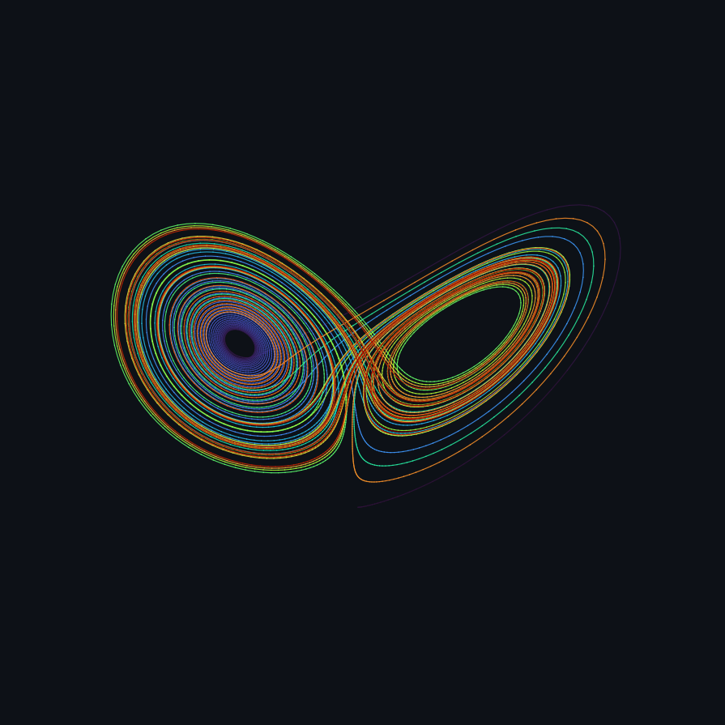
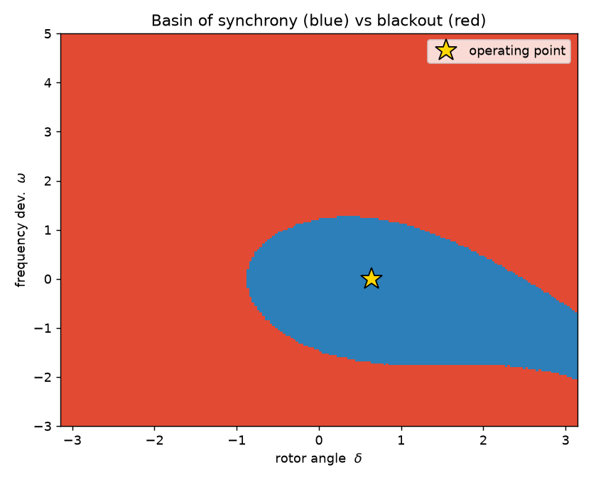
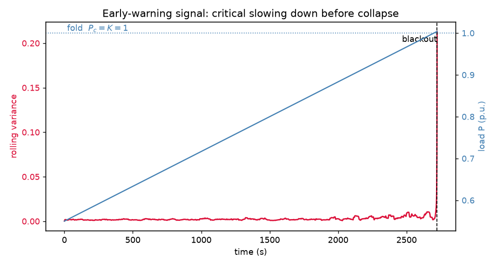

<h1 align="center">Nonlinear Dynamics, Hands-On</h1>
<p align="center"><b>A hands-on workshop on <a href="https://github.com/El3ssar/TSDynamics">TSDynamics</a></b><br>
<i>Max Planck Institute for the Physics of Complex Systems · Dresden</i></p>

<p align="center">
  <a href="https://mybinder.org/v2/gh/El3ssar/tsdynamics-workshop/HEAD?urlpath=lab/tree/notebooks/00_orientation.ipynb"></a>
  <a href="https://colab.research.google.com/github/El3ssar/tsdynamics-workshop/blob/main/notebooks/00_orientation.ipynb"></a>
  =3.12">
  
</p>

<p align="center"></p>

> **Zero-install start:** click **launch Binder** above — a full JupyterLab with everything
> installed opens in your browser. Nothing to set up. (First launch takes a couple of minutes to build.)

---

## What is this?

A full day of **hands-on** nonlinear-dynamics computing built around
[**TSDynamics**](https://github.com/El3ssar/TSDynamics) — a zero-warmup, Rust-engine Python library
for ODEs/DDEs/SDEs, discrete maps, and a large chaos-analysis toolkit. You will *do* dynamical-systems
analysis the way you actually do it in research: integrate a model, reduce it to a map, quantify chaos,
reconstruct dynamics from a measured signal, map out basins and tipping points, and make plots and
animations you would happily put in a talk.

Every notebook is **self-contained, runnable, and exercised** (it ships already executed so you can read
it like a paper, then re-run and tinker). Each ends with **exercises** (and worked solutions). The day
finishes with a **capstone**: a realistic consulting mission you solve end-to-end with the library.

No prior experience with the library is assumed — only the usual nonlinear-dynamics background
(flows, maps, Lyapunov exponents, bifurcations) that this audience already has.

---

## Get started in 60 seconds

| | How | Best for |
|---|---|---|
| ☁️ **Binder** | [**Launch**](https://mybinder.org/v2/gh/El3ssar/tsdynamics-workshop/HEAD?urlpath=lab/tree/notebooks/00_orientation.ipynb) — one click, nothing to install | the workshop itself, any laptop |
| ☁️ **Colab** | Use the "Open in Colab" badge on each notebook below | if you like Colab / have a Google account (needs Python ≥ 3.12) |
| 💻 **Local (uv)** | `git clone … && cd tsdynamics-workshop && ./setup.sh && ./.venv/bin/jupyter lab` | fastest local setup |
| 💻 **Local (conda)** | `conda env create -f environment.yml && conda activate tsdynamics-workshop && jupyter lab` | conda users |
| 🧑‍💻 **Codespaces / VS Code** | "Open in a Dev Container" (config in `.devcontainer/`) | cloud IDE |

All paths install exactly the same pinned stack (`tsdynamics==5.3.1` + the notebook toolchain).

---

## The notebooks

Work through them in order. Each is ~15–35 min of guided material plus exercises.

| # | Notebook | You will learn to… | |
|---|----------|--------------------|---|
| 00 | **Orientation** | the `System → Trajectory → Analysis → Viz` mental model; run your first attractor; tour the 154-system catalogue | [](https://colab.research.google.com/github/El3ssar/tsdynamics-workshop/blob/main/notebooks/00_orientation.ipynb) |
| 01 | **Integration** | integrate ODEs, maps, DDEs and SDEs; pick solvers & backends; detect events; step interactively | [](https://colab.research.google.com/github/El3ssar/tsdynamics-workshop/blob/main/notebooks/01_integration.ipynb) |
| 02 | **Build your own system** | define custom ODE/map/SDE models the right way (the gotchas!); automatic Jacobians | [](https://colab.research.google.com/github/El3ssar/tsdynamics-workshop/blob/main/notebooks/02_build_your_own_system.ipynb) |
| 03 | **Phase space & bifurcations** | Poincaré & stroboscopic maps, return maps, orbit/bifurcation diagrams, the period-doubling cascade | [](https://colab.research.google.com/github/El3ssar/tsdynamics-workshop/blob/main/notebooks/03_phase_space_bifurcations.ipynb) |
| 04 | **Lyapunov & chaos** | Lyapunov spectra, Kaplan–Yorke dimension, GALI, the 0–1 test, expansion entropy | [](https://colab.research.google.com/github/El3ssar/tsdynamics-workshop/blob/main/notebooks/04_lyapunov_and_chaos.ipynb) |
| 05 | **Time-series analysis** | delay embedding, correlation dimension, entropies, RQA, surrogate tests, spectra — *from data alone* | [](https://colab.research.google.com/github/El3ssar/tsdynamics-workshop/blob/main/notebooks/05_time_series_analysis.ipynb) |
| 06 | **Fixed points & stability** | equilibria and periodic orbits, eigenvalue/Floquet stability, rigorous root finding | [](https://colab.research.google.com/github/El3ssar/tsdynamics-workshop/blob/main/notebooks/06_fixed_points_stability.ipynb) |
| 07 | **Basins & tipping** | attractors, basins, fractal boundaries, basin stability, resilience, continuation & tipping points | [](https://colab.research.google.com/github/El3ssar/tsdynamics-workshop/blob/main/notebooks/07_basins_and_tipping.ipynb) |
| 08 | **Visualization & animation** | the `viz` layer: composed figures, themes/styling, and GIF/MP4/interactive-HTML animations | [](https://colab.research.google.com/github/El3ssar/tsdynamics-workshop/blob/main/notebooks/08_visualization_animation.ipynb) |
| 09 | **🏆 Capstone — Guardian of the Grid** | put it all together on a realistic mission (see below) | [](https://colab.research.google.com/github/El3ssar/tsdynamics-workshop/blob/main/notebooks/09_capstone_student.ipynb) |

---

## 🏆 The capstone: *Guardian of the Grid*

> A synchronous generator has been showing erratic frequency swings, and a sister unit just suffered an
> unexplained **blackout** during a slow load increase. You are the dynamical-systems analyst on call.
> Two data logs land on your desk. Management wants answers.

Using nothing but the tools from the day, you will:

1. **Diagnose** the monitored signal — is the wobble *deterministic chaos* (controllable) or *random noise*?
   (embedding, correlation dimension, Lyapunov-from-data, surrogate testing)
2. **Model** the machine with the swing equation and map its **safe operating region** — where does
   "losing synchrony" live in state space? (fixed points, basins, basin stability, resilience)
3. **Warn** — read the sister unit's stress-test log for **early-warning signals** of the coming collapse,
   and pin down the exact **tipping point** in parameter space. (critical slowing down, continuation, tipping points)

The scenario is a toy, but the physics is real: the swing equation is *the* textbook model of power-grid
synchronization, and the analysis mirrors how critical transitions are studied in climate, ecology, and
engineering. Start with **`notebooks/09_capstone_student.ipynb`** (scaffolded); a full worked solution is in
**`notebooks/09_capstone_solution.ipynb`**. The briefing is in [`capstone/mission_brief.md`](capstone/mission_brief.md).

<p align="center">
  
  
</p>

---

## Suggested schedule (one day)

| Time | Block |
|------|-------|
| 09:00 | Orientation + Integration (00–01) |
| 10:30 | Build your own system (02) |
| 11:30 | Phase space & bifurcations (03) |
| 13:30 | Lyapunov & chaos + Time-series analysis (04–05) |
| 15:00 | Fixed points + Basins & tipping (06–07) |
| 16:15 | Visualization & animation (08) |
| 16:45 | 🏆 Capstone (09) |

Two-half-day or self-paced formats work equally well — the notebooks are independent enough to reorder.

---

## Prerequisites

- **Python ≥ 3.12** (required by the library's wheels). Binder/Colab already satisfy this.
- Comfort with Python + NumPy and a working knowledge of nonlinear dynamics.
- For local animation to `.mp4`: `ffmpeg` (GIF export needs nothing extra; conda/Codespaces install it for you).

## Repository layout

```
notebooks/     the 9 teaching notebooks + the capstone (student & solution)
capstone/      the mission brief, the shared grid model, and the data generator
   data/       the datasets you analyse in the capstone
assets/img/    figures & animations used in the notebooks and this README
requirements.txt / environment.yml / setup.sh / Makefile / .devcontainer/   setup for every platform
```

## About TSDynamics

TSDynamics is an open-source library for studying dynamical systems: a Rust integration engine with a
symbolic Python front end, 150+ built-in systems, and analysis tools spanning Lyapunov exponents,
dimensions, entropies, recurrence quantification, surrogates, basins, and more.
Docs: **https://el3ssar.github.io/TSDynamics/** · Source: **https://github.com/El3ssar/TSDynamics**

## License & credits

Workshop materials © 2026 Daniel Estevez, released under the [MIT License](LICENSE).
Built for the community at the **Max Planck Institute for the Physics of Complex Systems**, Dresden.
